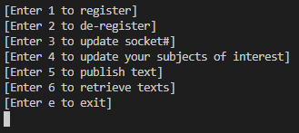
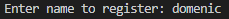
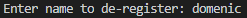
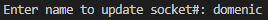
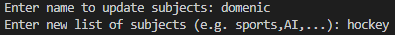
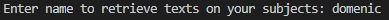

# Register and Share System (RSS)

## Introduction
This project consists of a "Register and Share System" where users can share information on subjects of interest and remain up to date on these subjects. The main technologies used to implement this project include the following:
* Python
* Socket Programming (UDP)
* MongoDB
* NoSQL Database

## Protocol Overview
The Register and Share System (RSS) consists of several clients and two servers. The goal of the RSS is to allow for users to share information on subjects of interest and remain up to date on these subjects.
There are two servers, let us name them Server A and Server B, but only one of them is serving at a time. Both servers are known to the clients (i.e. IP addresses and port numbers
are known). Initially Server A is serving, but after a short period of time (2 minutes) Server A informs all the registered users that it is not anymore serving and they need to talk to the other server. After receiving such a message the users talk to Server B only. Same thing happens with Server B after a short period of time, and so on… Users always talk to the server currently serving.

When a server decides to not anymore serve, it informs the other server which will take over. A new user does not know which one is the current server, so it talks to both them, but only the serving one will answer. Both servers have exactly the same information about the users and what is going on. A user has a unique name but where he/she can be reached can change over time. 

The users can register to the current server, inform the servers of their subjects of interest, send and receive updates from the current server. A user can update his/her his address (IP address and Port number), or subjects of interest anytime. A user will receive updates about his/her subjects of interest only. A user can deregister, in this case he/she will not publish or receive updates anymore.

## Features
The user of the RSS system several options to choose from in the terminal. Every time the user sends a request, the active server will respond with a "SUCCESS" or "DENIED" in order to inform the user whether or not the request was processed. The entire list of features the client may request is listed below:
1. Register
2. De-Register
3. Update Socket#
4. Update Subjects of Interest
5. Publish Texts
6. Retrieve Texts

### REGISTER
A new user can register using a unique username.

### DE-REGISTER
A user can also de-register to no longer be in the system.

### UPDATE-SOCKET
If a user moves to a new IP or Port Number and would like this information to be reflected in the database, they can request an update to the socket number.

### SUBJECTS
A user can update their subjects of interest at any time.

### PUBLISH
A new user can publish a message on their registered subjects of interest.

### RETRIEVE-TEXTS
A user can query for messages on their list of subjects. This will retrieve all messages the user has not seen yet where the subject is included in the user's list of interests.

